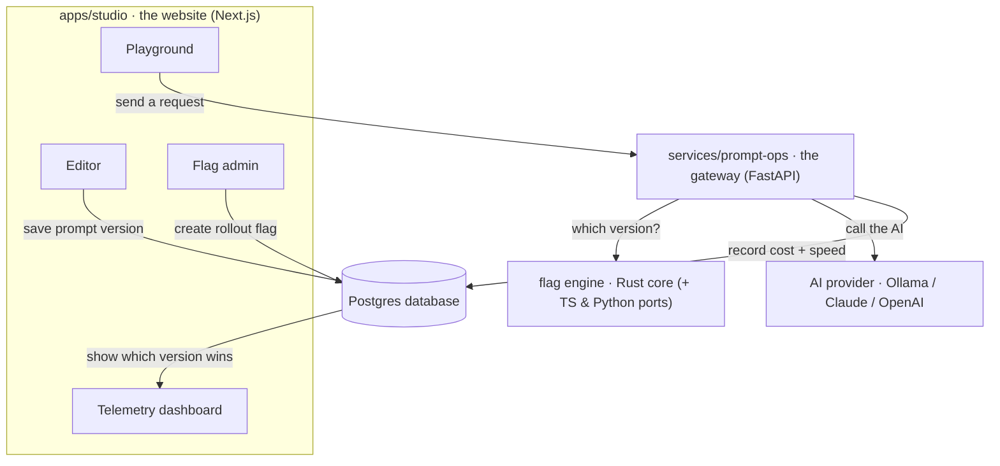

# Relay

**An end-to-end prompt-deployment platform.** Author an AI system prompt, ship it through a
gateway, A/B-test it with feature flags, and track cost & latency per version — so you can tell
which prompt actually wins in production.

Built as a **polyglot monorepo**: a **Rust** flag engine, a **TypeScript** web app, and a
**Python/FastAPI** gateway, wired together with pnpm + Turborepo + Cargo.

---

## What it is, in plain English

Teams that build with AI constantly tweak their prompts (the instructions you give the model).
But which wording is actually better? Relay lets you:

1. **Write a prompt together**, live, like a Google Doc.
2. **Roll it out to a slice of users** (e.g. "send 50% of people version A, 50% version B").
3. **Measure** which version is cheaper and faster, and which one users get — automatically.

It's the kind of internal tool real AI companies build. The interesting part for an employer
isn't any single page — it's that the pieces are written in **three languages that all have to
agree**, and they're wired into **one working product**.

> **New to the jargon?** Jump to the [Glossary](#glossary-plain-english) — every bold term
> below is explained there.

---

## How a request flows



**The loop:** write a prompt version → put it behind a **flag** with a % split → a request hits
the **gateway** → the **flag engine** deterministically picks a version from who's asking → the
gateway calls the AI and records `{version, tokens, latency}` → the **telemetry** dashboard shows
which version performs better.

---

## The flag engine — one algorithm, three languages

The rule for "which version does this user get?" is written **three times** — in **Rust**
(`packages/flag-core`), **TypeScript** (`@relay/flag-sdk`), and **Python** (`prompt-ops`) — and
a shared test file (`packages/flag-core/conformance/cases.json`) proves all three produce the
*exact same answer* for every case. That "one verified core, zero drift" story is the headline
engineering flex.

> **Why three languages?** The website is TypeScript, the gateway is Python, and the engine is
> Rust for portability. Re-implementing the same logic and *proving* they match is exactly what
> real feature-flag companies do to avoid bugs where their SDKs disagree.

---

## Layout

```
relay/
├─ apps/studio/            the website: editor, flag admin, telemetry, playground (Next.js)
├─ services/
│  ├─ prompt-ops/          the gateway: routes + calls the AI + logs results (Python/FastAPI)
│  └─ sync-server/         real-time collaboration server (Yjs CRDT over WebSockets)
├─ packages/
│  ├─ flag-core/           the Rust flag-evaluation engine + the shared conformance test
│  ├─ flag-sdk/            the TypeScript version of the engine
│  ├─ db/                  database schema + migrations (Drizzle + Postgres)
│  ├─ core/                shared settings + types
│  ├─ ui/                  shared design system (Tailwind + shadcn)
│  └─ {eslint,typescript}-config/
└─ infra/docker-compose.yml   one command to start Postgres + Redis locally
```

---

## Status

| Phase | Scope | State |
|------|-------|-------|
| 0–1 | Polyglot scaffold + shared foundation | ✅ |
| 2 / 2.5 | Editor, flag admin, telemetry dashboard + gateway database | ✅ |
| 3 | Real-time collaborative editing (Yjs CRDT) | ✅ |
| 4a | Rust `flag-core` engine + 3-language conformance | ✅ |
| 5 | Multi-provider (Claude/OpenAI/Ollama) + live streaming + flag cache | ✅ |
| 6 | Deploy: configs + runbook + CI/CD — see **[docs/DEPLOY.md](docs/DEPLOY.md)** | ✅ ready |
| 4b | Native Rust bindings (napi-rs / Wasm / PyO3) | ⏸️ deferred — **[plan](docs/PHASE-4B-BINDINGS.md)** |

**Security:** `pnpm audit` → **0 known vulnerabilities**. **Tests:** flag-sdk 7 (vitest) ·
prompt-ops 15 (+1 skip, pytest) · flag-core `cargo check` + `clippy` clean · studio `next build`
(9 routes).

---

## Run it on your own computer

You need [Node](https://nodejs.org) and [Docker](https://www.docker.com/products/docker-desktop/);
optionally [uv](https://docs.astral.sh/uv/) (Python) and [Ollama](https://ollama.com) for the AI.

```bash
corepack pnpm install                                  # install website deps
docker compose -f infra/docker-compose.yml up -d       # start Postgres + Redis
corepack pnpm --filter @relay/db db:migrate            # create the database tables

# the gateway (terminal A)
cd services/prompt-ops && uv run uvicorn app.main:app --port 8000
# the website (terminal B)
corepack pnpm --filter studio dev                      # opens http://localhost:3000
```

Open **/playground**, click **Run**, and change the "unit id" to watch the version flip — the
same user always gets the same version. *(On a network that intercepts HTTPS, add `--native-tls`
to `uv` and set `NODE_OPTIONS=--use-system-ca` before pnpm.)*

---

## Putting it online (optional)

Everything is configured for free hosting tiers; **[docs/DEPLOY.md](docs/DEPLOY.md)** is a
copy-paste runbook. Short version: **Neon** hosts the database, **Upstash** hosts Redis, **Fly.io**
runs the gateway + collaboration server, and **Vercel** runs the website. The final `deploy`
commands are the only steps that need your own (free) accounts.

---

## Glossary (plain English)

- **System prompt** — the hidden instructions you give an AI model ("You are a terse support
  agent…"). Tweaking it changes the AI's behavior.
- **Feature flag** — a switch that turns something on for *some* users without redeploying. Here,
  a flag decides *which version of a prompt* a given user gets.
- **A/B test** — show different versions to different users and measure which performs better.
- **Gateway** — a middleman server that sits between an app and the AI provider; it decides which
  prompt to use, calls the AI, and records what happened.
- **Telemetry** — the recorded stats for each request (tokens used = cost, latency = speed).
- **CRDT / Yjs** — the technology that lets multiple people edit the same document at once without
  their changes clobbering each other (the magic behind Google-Docs-style editing).
- **Deterministic bucketing** — the same user always lands in the same A/B group, computed with a
  hash so it's stable and needs no database lookup.
- **Monorepo** — one Git repository holding several apps/packages. **Polyglot** = in multiple
  programming languages (here Rust + TypeScript + Python).
- **Binding (napi-rs / Wasm / PyO3)** — a wrapper that lets other languages call Rust code. (These
  are the deferred Phase 4b — see the plan doc.)

---

## Tech

TypeScript · Rust · Python · Next.js (App Router, Server Actions) · FastAPI · Drizzle ORM ·
Postgres · Redis · Yjs (CRDT) · Turborepo · pnpm · Cargo · Docker · Vitest · pytest · GitHub Actions.

## License

MIT
