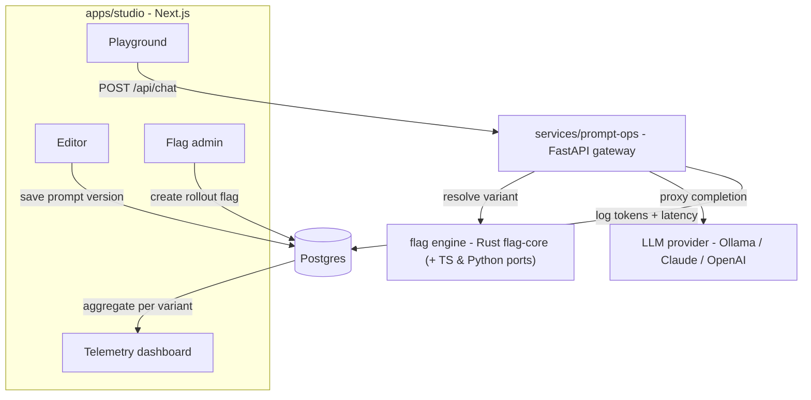

# Relay

**An end-to-end prompt-deployment platform.** Author a system prompt, deploy it through an
LLM gateway, A/B-test it with feature flags, and track cost & latency per variant — so you
can tell which prompt actually wins in production.

Relay is a **polyglot monorepo**: a **Rust** flag engine, a **TypeScript** web app + SDK, and
a **Python/FastAPI** gateway, wired together with pnpm + Turborepo + Cargo.

## Architecture



**The loop:** author a prompt version → put it behind a flag with a % rollout / A-B split →
a request hits the gateway → the flag engine deterministically picks a variant from the
caller's `unitId` → the gateway proxies the LLM call and logs `{variant, tokens, latency}` →
the telemetry dashboard shows which variant performs better.

## The flag engine — one algorithm, three languages

Flag evaluation (FNV-1a bucketing → basis-point rollout gate → weighted variant split) is
implemented in **Rust** (`packages/flag-core`), **TypeScript** (`@relay/flag-sdk`), and
**Python** (`prompt-ops`). A shared fixture (`packages/flag-core/conformance/cases.json`,
generated by the Python engine) is asserted by every language's test suite, so a decision is
provably identical everywhere. Anchor vectors all three pin: `fnv1a("") = 2166136261`,
`fnv1a("a") = 3826002220`.

> Why Rust for flags? Not raw speed — portability + parity. One verified core compiles to a
> Node addon (napi-rs), edge/browser (Wasm), and a Python wheel (PyO3), so every runtime runs
> the *same* logic with zero SDK drift.

## Layout

```
relay/
├─ apps/studio/            Next.js: editor, flag admin, telemetry, playground
├─ services/
│  ├─ prompt-ops/          FastAPI LLM gateway (Python) + Postgres repo
│  └─ sync-server/         Yjs CRDT WebSocket server (Phase 3)
├─ packages/
│  ├─ flag-core/           Rust flag-eval engine + conformance fixture
│  ├─ flag-sdk/            TS flag client (Wasm/napi binding swap in Phase 4)
│  ├─ db/                  Drizzle schema + migrations (Postgres)
│  ├─ core/                zod env + shared types
│  ├─ ui/                  Tailwind + shadcn design system
│  └─ {eslint,typescript}-config/
└─ infra/docker-compose.yml
```

## Status

| Phase | Scope | State |
|------|-------|-------|
| 0–1 | Polyglot scaffold + shared foundation | ✅ |
| 2 | Walking skeleton (engine + gateway + studio playground) | ✅ |
| 2.5 | Studio editor / flag-admin / telemetry + gateway Postgres | ✅ |
| 4a | Rust `flag-core` + 3-language conformance | ✅ |
| 3 | Real-time collab editing (Yjs CRDT) | ✅ |
| 5 | Multi-provider (Claude/OpenAI/Ollama) + SSE streaming + flag cache | ◐ (load-test left) |
| 6 | Deploy configs (Vercel + Fly + Docker) | ◐ |
| 4b | napi-rs / Wasm / PyO3 bindings | ⬜ (needs MSVC/Linux) |

## Quickstart

```bash
corepack pnpm install                                  # JS deps
docker compose -f infra/docker-compose.yml up -d       # Postgres + Redis
corepack pnpm --filter @relay/db db:migrate            # apply schema

# gateway (terminal A)
cd services/prompt-ops && uv run uvicorn app.main:app --port 8000
# studio (terminal B)
corepack pnpm --filter studio dev                      # http://localhost:3000
```

Open `/playground`, hit **Run**, and change the unit id to watch the variant flip
deterministically. (On a TLS-intercepting network, add `--native-tls` to `uv` and
`NODE_OPTIONS=--use-system-ca` to pnpm.)

## Tested

| Suite | Result |
|-------|--------|
| `@relay/flag-sdk` (vitest) | 7 passing (incl. conformance) |
| `prompt-ops` (pytest) | 15 passing + 1 skip (Postgres smoke) |
| `flag-core` (cargo) | check + clippy clean; tests run on CI |
| `studio` (next build) | 9 routes compile + type-check |

## Tech

TypeScript · Rust · Python · Next.js (App Router, Server Actions) · FastAPI · Drizzle ORM ·
Postgres · Redis · Yjs (CRDT) · Turborepo · pnpm · Cargo · Docker · Vitest · pytest ·
GitHub Actions.

## License

MIT
