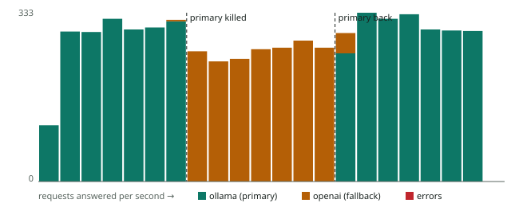

# ADR 0002: Ordered provider failover, only before the first token

**Status:** accepted · **Roadmap item:** R3

## Problem

Each prompt version had one provider, called with a flat 120-second timeout, so any provider
outage failed every request routed to it. The gateway also ignored a version's provider: it
always called `RELAY_DEFAULT_PROVIDER` while writing the version's provider into telemetry, so
per-provider cost and latency could be credited to a provider that never ran.

## Decision

- **Routes.** A request tries, in order: the version's provider/model, the version's
  `fallbacks` (new `prompt_versions.fallbacks` column), then gateway-wide `RELAY_FALLBACKS`.
- **When to move on.** Only when the provider looks unavailable: a timeout, a refused or dropped
  connection, 429, or 5xx. A 4xx returns 502 immediately: the next provider would receive the
  same bad request, and a 401 means a configuration error that failover would hide.
  Unconfigured or unknown providers in a chain are skipped and recorded.
- **Streams.** Failover is allowed only until the first chunk exists; the gateway finds a working
  route before it starts the response, so a total failure is a real 502. After the first token, a
  failure ends the stream with an `error` field on the final event.
- **Timeouts.** Per provider (`RELAY_TIMEOUTS`). Defaults: Ollama 3 s connect / 120 s read (a
  local model can take a while to load), hosted APIs 5 s / 60 s.
- **Telemetry.** `provider`/`model` now record who actually answered; the new
  `fallback_reason` records why earlier routes were skipped, e.g. `ollama/llama3.2: timeout`.

## Why not fail over mid-stream

The client already has part of an answer. A second provider would start from scratch, so the
user would see duplicated or contradictory text, and both providers would bill for the request.

## Evidence

- `services/prompt-ops/tests/test_failover.py`: 22 tests drive the real endpoints and the real
  provider HTTP code with faults injected at the HTTP layer (read and connect timeouts, refused
  and dropped connections, 429, 500, 503, 400/401/404/422, a stream that drops after its first
  token). Mutation checks: the tests fail if 4xx were retried, if a stream failed over after its
  first token, or if routing ignored the version's provider.
- `loadtest/failover_demo.py`: 10 requests in flight against two stand-in providers; the primary
  is killed at 7 s and restarted at 14 s. Result: **5,921 of 5,921 requests succeeded, 1,846 of
  them answered by the fallback**, with traffic returning to the primary once it was back. Raw
  data and chart: `services/prompt-ops/loadtest/results/20261006T182600Z-failover-demo-sandbox-4vcpu/`.

  

- The demo caught a bug the unit tests had missed: with no API key, the OpenAI-compatible
  provider sent `authorization: Bearer ` (empty), an invalid header, so every fallback call
  failed. Fixed and covered by a test.

## Rejected alternatives

- **Retry the same provider first.** Adds load to a provider that is already failing and delays
  the switch; a fallback is a different provider by design.
- **Fail over on every error.** Masks misconfiguration and sends known-bad requests to a second
  provider.
- **A `served_by` column next to `provider`.** Redundant once `provider` records who
  actually answered.

## Consequences and follow-ups

- During an outage every request still tries the dead primary first. A refused connection is
  fast, but in the demo throughput dipped from about 320 to about 265 requests per second while
  the primary was down. A circuit breaker (skip a provider for a few seconds after repeated
  failures) would remove that cost; deferred until real traffic shows it matters.
- Existing databases need migration `0001` before this gateway version, since it writes
  `telemetry.fallback_reason` and reads `prompt_versions.fallbacks`.
